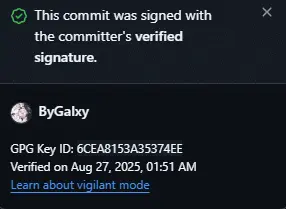

# git 签署提交

Git 虽然是密码级安全的，但它不是万无一失的。 如果你从因特网上的其他人那里拿取工作，并且想要验证提交是不是真正地来自于可信来源， Git 提供了几种通过 GPG 来签署和验证工作的方式。

### GPG 介绍

首先检查你的 GPG 密钥

```
gpg --list-secret-keys --keyid-format LONG
```

在开始签名之前你需要先配置 GPG 并安装个人密钥。

```console
$ gpg --list-keys
/Users/schacon/.gnupg/pubring.gpg
---------------------------------
pub   2048R/0A46826A 2014-06-04
uid                  Scott Chacon (Git signing key) <schacon@gmail.com>
sub   2048R/874529A9 2014-06-04
```

如果你还没有安装一个密钥，可以使用 `gpg --gen-key` 生成一个。

```console
$ gpg --gen-key
```

获取你的密钥 ID 

```
gpg --list-secret-keys --keyid-format LONG
```

一旦你有一个可以签署的私钥，可以通过设置 Git 的 `user.signingkey` 选项来签署。

```console
$ git config --global user.signingkey 0A46826A
```

现在 Git 默认使用你的密钥来签署标签与提交。

配置 Git 使用正确的密钥

```
git config --global user.signingkey YOUR_KEY_ID
```

要将 Git 客户端配置为默认情况下对本地存储库的提交进行签名，请在 Git 版本 2.0.0 及更高版本中运行 。要默认情况下对计算机上任何本地存储库中的所有提交进行签名，请运行 。`git config commit.gpgsign true` `git config --global commit.gpgsign true`

导出公钥
```
gpg --armor --export YOUR_KEY_ID
```

测试提交
```
git commit -a -S -m '测试'
```



成功了，太酷啦()